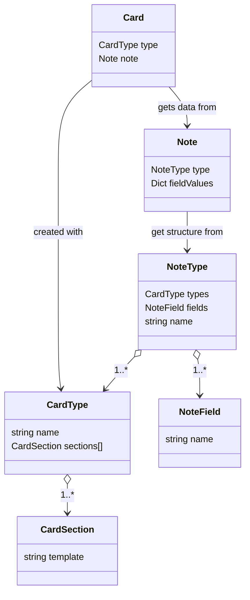

# Models
`CardSection` - a part of the `Card` that is formed from the section template and the value of the Notes fields. Each `Card` can have several sections. The first section is called a question, the rest are the answer.

`CardType` - a template by which the cards are formed. It can consist of several sections.

`NoteField` - the data in the `Note` is saved in the fields. The field values are injected into the `CardSection` to generate the `Card`.

`NoteType` - the template by which the notes are created. Each note type has its own fields and card types.

`Note` - a record containing data to generate multiple cards created using card type template.

Suppose we have "Foreign Word" note type. It has the following fields: "word", "translation", "audio", "example". It also has two card types: _word → translation_ and _translation → word_. Each card type have three sections: _front_ that shows word or translation; _back_ that shows translation or word (and audio); _examples_ that show word usage examples

