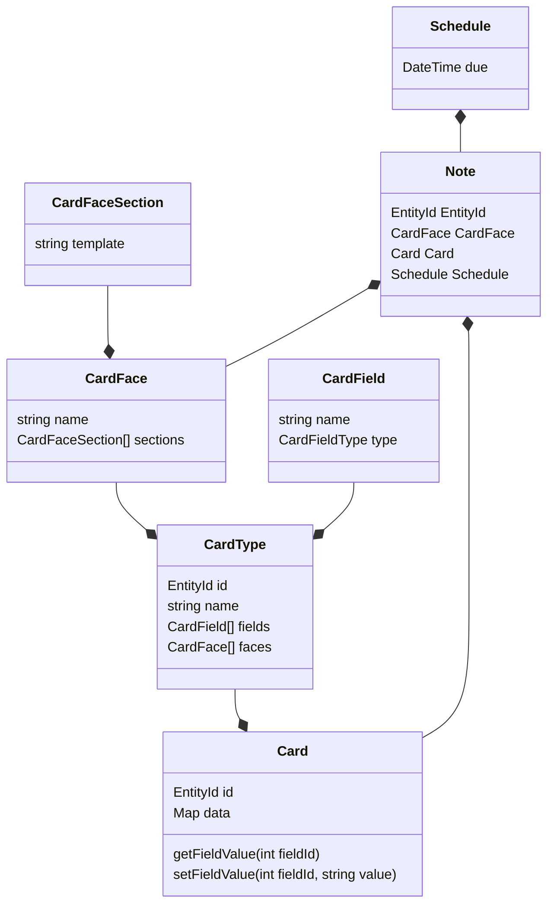

# Models
Suppose we have "Foreign Word" card type (`CardType`). It has the following fields (`CardField`): "word", "translation", "audio", "example". It also has two faces (`CardFace`): _word → translation_ and _translation → word_. Each face have three sections: _front_ that shows word or translation; _back_ that shows translation or word (and audio); _examples_ that show word usage examples

